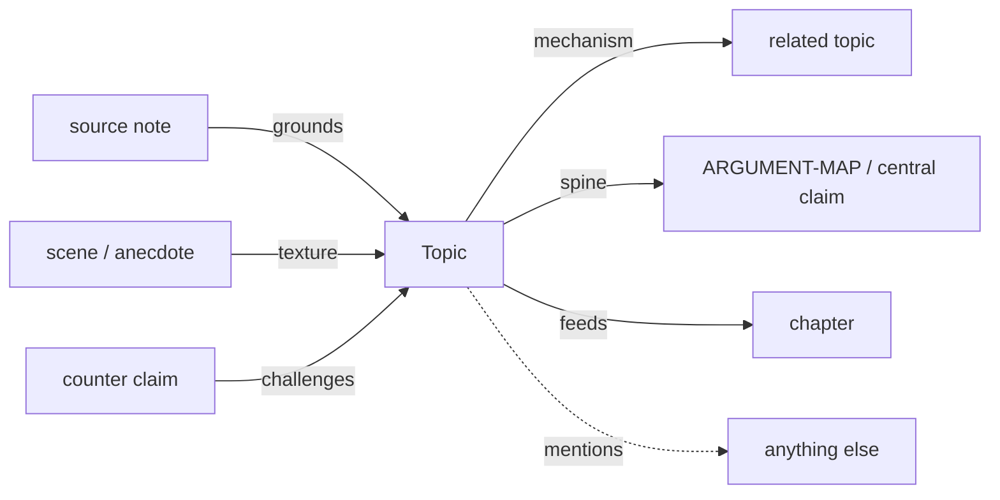

# Typed relationship ontology for the book archive

## What you have today

Your explorer already builds a **directed graph of path mentions** ([`explorer/src/lib/loadArchive.ts`](explorer/src/lib/loadArchive.ts)): backticks, markdown links, and bare paths become edges. Pinning shows in/out neighbours. There is **no edge type** — only direction and folder colour.

In the prose you already *imply* why links exist, but only as human labels:

- `Related mechanism:` / `Related branch:` → structural
- `Cross-link:` → loose adjacency
- Scene / personal / “See SCENE-BANK” → texture
- Claim ledger types (`fact`, `personal-experience`, …) classify **claims**, not **edges** ([`book/CLAIM-LEDGER.md`](book/CLAIM-LEDGER.md))
- [`book/ARGUMENT-MAP.md`](book/ARGUMENT-MAP.md) is a conceptual spine, not encoded graph edges

So your instinct is right: the map is richer than “references,” but the software only sees references.

## What other writers / Obsidian users do

Three camps show up repeatedly:

### 1. Spatial hierarchy (ExcaliBrain / TheBrain)

Default axes: **parent / child / friend / sibling / previous / next**. Good for navigation. Weak for *why* an argument edge exists. Practitioners who care about writing often rename those fields to semantic verbs (`supports`, `opposes`, `leads to`) — Nicole van der Hoeven and Ton Zijlstra both call that the high-value use.

### 2. Property-as-edge-type (Breadcrumbs, Graph Link Types, Graph Plus, Wikilink Types)

The Obsidian ecosystem pattern:

```md
supports:: [[Claim]]
parent: [[Structure note]]
```

or inline `[[supports::Target]]` / `@type` in aliases synced to YAML. Graphs then **colour and filter by type**. Storage is usually frontmatter or Dataview fields; the link itself stays a normal wiki-link.

### 3. Discourse Graphs (Joel Chan) — best fit for argument writing

Minimal schema for research/writing synthesis:

| Nodes | Relations |
|-------|-----------|
| Question, Claim, Evidence, Source | **supports**, **opposes**, **addresses**, **informs** |

This matches your claim ledger more than ExcaliBrain’s family metaphor. Zettelkasten orthodoxy warns against over-typing every link — put reason in **link context** or structure notes — but a **small closed set** is exactly what Discourse Graphs and the Typed Links presets recommend when you want filterable argument maps.

**Typed Links plugin presets** (for comparison): `supports` / `contradicts` / `extends` / `synthesizes` plus hierarchy `parent`/`child`/`see-also`. Useful, but too software-ish / too generic for a memoir-argument book.

## Proposed mini ontology (six types + residual)

Closed vocabulary of **six typed edges**, plus untyped path mentions as residual `mentions` (filterable off). Names chosen to match how you already talk about the book:

| Type | Why the link exists | Typical from → to | Maps from your current prose |
|------|---------------------|-------------------|------------------------------|
| `spine` | Load-bearing on the core thesis / argument chain | topic ↔ topic, topic → ARGUMENT-MAP / central claims | “this is the book’s point”; mechanism→consequence on the trajectory |
| `mechanism` | Structural causal plumbing (how X produces Y) | topic → related mechanism topic | `Related mechanism:`, Shared Failure under-layer |
| `grounds` | Evidence or sourced fact that bears weight | source/note → topic or claim | Evidence held, SOURCE-INDEX, fact-bearing refs |
| `texture` | Anecdote, scene, lived colour — illuminates without proving | scene/inbox/personal → topic | SCENE-BANK, personal-experience, “texture” |
| `challenges` | Counterargument or adverse evidence | claim/topic ↔ counter | Strongest Counterargument / My Response pairs |
| `feeds` | Composition: material destined for a manuscript unit | topic/scene → chapter / CHAPTER-MAP | Possible Chapter Use, chapter hooks |

**Residual:** plain path mentions with no type stay `mentions` (today’s behaviour). Do not require every link to be typed — only type when the *why* matters for filtering or argument hygiene.



This is deliberately **not** ExcaliBrain parent/child and **not** a 24-type kitchen sink. It is Discourse-Graph argument edges (`grounds`/`challenges` ≈ supports/opposes) plus two writing-specific roles you named (`texture`, `spine`) and one book-architecture role (`feeds`).

## Encoding (keep “simple Markdown, not a database”)

Adopt the Obsidian/Dataview field pattern already familiar to that world, adapted to your existing backtick paths:

```md
mechanism:: `topics/taxing-activity-rewarding-scarcity.md`
texture:: `scenes/SCENE-BANK.md`
grounds:: `sources/notes/sweden-first-hand-tenure-allmannytta.md`
challenges:: `book/CLAIM-LEDGER.md`
feeds:: `chapters/...`   # or chapter slug once stable
spine:: `book/ARGUMENT-MAP.md`
```

Rules:

- One type per line; target is the same resolvable path the explorer already understands.
- Untyped `` `path.md` `` keeps working as `mentions`.
- No mandatory YAML frontmatter on every note (preserves current archive style).
- Optional later: a short Relationships section on hot topics; no mass rewrite of the whole vault on day one.

Document the vocabulary once in something like [`book/RELATION-TYPES.md`](book/RELATION-TYPES.md) (or a subsection of README) with the table above and authoring examples.

## Explorer changes (so you can filter)

Extend edge extraction in [`explorer/src/lib/loadArchive.ts`](explorer/src/lib/loadArchive.ts):

1. Parse `type:: `path`` (and markdown-link variants) → edge `{ source, target, type }`.
2. Existing bare path refs → `type: "mentions"`.
3. UI on [`explorer/src/routes/+page.svelte`](explorer/src/routes/+page.svelte): chip toggles for the six types + `mentions`; off = hide those edges (and optionally dim nodes that only connect via hidden types).
4. Edge stroke/label by type (subtle colour or short label on pin-focus), so the map reads as *why*, not only *that*.

## Rollout order

1. Write the ontology note + examples from 2–3 real existing links (e.g. housing → taxing-activity as `mechanism`, Poseidon scene as `texture`, tenure source as `grounds`).
2. Parser + filter in explorer (untyped archive still works).
3. Retype high-value links only (ARGUMENT-MAP neighbours, a few topics with heavy cross-links) — not a full vault migration.
4. Optionally align claim-ledger wording later (`supports`/`opposes` language ↔ `grounds`/`challenges` edges) without merging claim *types* and edge *types* into one confusing enum.

## What we are not doing

- Not adopting Obsidian plugins or wiki-link syntax (`[[…]]`) as a requirement.
- Not inventing a large RDF/OWL ontology.
- Not typing every accidental mention — that recreates an undifferentiated web with more ceremony.